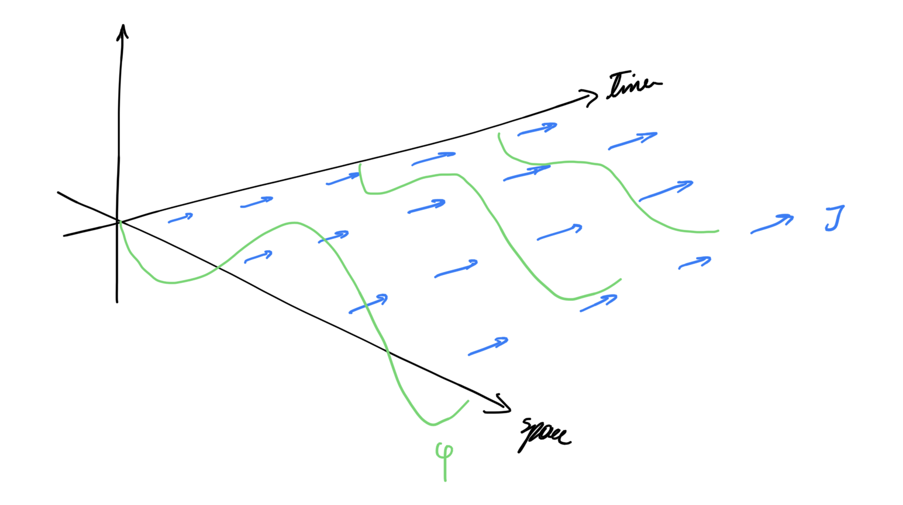

# Dissipation Currents

*A generalized way to convariantly express dissipative systems.*

## Motivation

Dealing with dissipative systems is hard, as usually langrians are not covariant which results in needing to add lagrange multipliers using some fictitious generalized forces. However, this can also fail because there is no reason for the lagrange multiplier terms to be covariant. We need a different approach. 

In thermodynamics, one treats an open system by including its surroundings. However, this implies that we need some understanding of the surrounding system in order to proceed. This can grow very quickly to an unmanageably complex description. Therefore we need a way to simplify the description.

However, for sufficiently simple systems one can simply introduce a mirror system that instead of loosing energy it gains energy. This is similar to the original system as if it was evolving backwards in time *(hence the term mirror).* An example of this is a wave in a dissipative medium, generating another (virtual) wave with the energy lost.  Here we will use mirror systems to provide a more general description of Dissipative systems. 

## Dissipation Current Intuition

Consider a wave in 1 spatial dimension. We can represent it using a smooth function over $\R^2$ where one dimension is space and the other is time. Here is a picture of it (right)

In a normal case of dissipation we have the same wave, only it is simply damped towards the time direction, as its decreases with increasing time. We could think of this as having to squeeze the wave between an envelope. Yet calculating the envelope is dificult for most applications.

Instead we can think of the dissipative component using vector fields. As you can see the magnitude of the gradient of the pressure decreases as we move further in time. Therefore, we can think of every point as a **sink for the gradient**, where more gradient enters than it comes out. How much? This is **proportional to the component of the gradient at the time direction**. In other words we can think of a current flowing all over the space, we will call that the dissipation current, and force our gradient to be sinked parallel to it. In this case the dissipation current is pointing towards the time direction at every point with the same magnitude.

----

### Mathematical Formulation

Here we rigorously formalize the intuition of the previous section using differential geometry. We will also show how it arizes from the formalism.

Consider an $n$ dimensional smooth manifold $M$ with a symplectic metric $g$. We will now define the structure for our fields. In this case we are working in a scalar field theory so we consider the follwoing Fiber Bundle $(E,\pi,M,\mathcal{F})$

Here it is a trivial vector bundle over the spacetime manfold $M$ with fiber $F = \R$. The set of smooth sections on $E$ is denoted as $\Gamma^\infty\cong C^\infty(M)$ and it is the set of smooth functions over $M$. 

### Dissipation Currents

**<u>Definition:</u>** A <u>dissipation current</u> $J \in \Omega^{n-1}(M)$ is an $n-1$ form over the manifold $M$. The current $J$ is <u>conserved</u> iff it is closed, i.e. $dJ=0$.

Using the current we can now create our lagrangian. Consider scalar field theory  where the field of interest is $\phi \in \Gamma^\infty \cong C^\infty(M)$. We need to introduce our mirror scalar field $\bar{\phi} \in \Gamma^\infty$ such that it has the same equation but with the opposite dissipation current. Notice that at this point, we haven’t specified any property on the field itself, other than the fact that $\bar{\phi}$ is another scalar field. Now we will relate them such that they can naturally lead to the dissipation formalism

**<u>Definition:</u>** Given a $k$-form $\omega \in \Omega^{k}(M)$ and and $m$-form $\eta \in \Omega^{m}(M)$ we can define their <u>dissipative form</u> $\lang \omega,\eta\rang_D$ is a bilinear map given by
$$
\begin{align*}
\lang\cdot,\cdot\rang_D : \Omega^k(M)\times \Omega^m(M) &\to \Omega^{k+m+1}(M)\\
(\omega,\eta) &\mapsto \lang\omega,\eta\rang_D \coloneqq d\omega \wedge \eta - (-1)^k\omega \wedge d\eta
\end{align*}
$$
Notice that the dissipation form is very similar to taking the exterior derivative $d(\omega \wedge\eta) = d\omega \wedge d\eta + (-1)^k \omega \wedge d\eta$. It just flips the sign between the terms. There is an interesting property of the dissipation form. 

**<u>Proposition:</u>** The <u>dissipative product</u> has the following properties:

1. Antisymmetric: $$\lang\eta,\omega\rang_D = - \lang\omega,\eta\rang_D$$
2. linear (by the linearity of the differential and wedge product)
3. $$\lang\eta,1\rang_D = d\eta$$

Come on I am not going to write a proof for this….

**<u>Proposition:</u>** Let $\phi = f\cdot h$ and $\bar{\phi} = \frac{f}{h}$ where $f,h \in C^\infty(M)$ with $h$ nonvanishing. Then the dissipation form is given by:
$$
\lang\phi,\bar{\phi}\rang_D = f^2\frac{dh^2}{h^2}
$$

***Proof:*** The proof is done by simple calculation
$$
\begin{align*}
\lang\phi,\bar{\phi}\rang_D
&= d\phi \wedge \bar\phi - \phi \wedge d\bar{\phi}\\
&= {\bar\phi}^2d\frac{\phi}{\bar\phi}\ \ \ \ \ \  \text{or } 0 \text{ iff }\bar\phi = 0\\
&= f^2\frac{dh^2}{h^2}
\end{align*}
$$
This is incospicuous until we set $\lang \phi,\bar{\phi}\rang = 2cf$ where $c=c_idx^i\in \Omega^1(M)$ and is constant, the factor of $2$ is important in context. This implies
$$
\begin{align*}
\frac{dh^2}{h^2} &= 2c_idx^i\\
dh &= hc_idx^i
\end{align*}
$$
Therefore we would obtain
$$
\begin{align*}
h:M&\to\mathbb{R}\\
p &\mapsto h(p) = \exp(c_ix^i(p))
\end{align*}
$$
Which is perfection! We saw how the dissipation form gives rize to the exponential envelope. Clearly current $J$ would instill a preferential direction to the exponential envelope.

**<u>*Example:*</u>** A simple example is when $\dim M = 1$. This way we have one dimensional functions for fields. In that case we would have some function $f(t)$ and an envelope $h(t)$. Let’s pick an $f(t)$ such that it satisfies the wave equation. We therefore have.

Then the damping envelope wil be given by
$$
\begin{align*}
dh &= hC\\
h &= \exp( t)
\end{align*}
$$

Therefore the field $\phi = f(t)e^{ct}$ and the mirror field would be $f(t)e^{-ct}$. We have showed that stationary points of the disispation form cause fields that have the damping characteristic. This can be seen in the picture where $f(t) = \sin(t)$

The blue curve is $\phi$, the red curve is its mirror $\bar\phi$ one loses energy in time the other one gains it. Note that the green curve is simply $c f^2 = \lang \phi,\bar{\phi}\rang_D$ which is really cool! It tells us that the dissipation form, removes the envelope and adds a mass term to the undamped field proportional to the damping coefficient!

### A Covariant Lagrangian

We are finally at a position to introduce the Lagrangian. Consider two scalar fields $\phi \in \Gamma^\infty$ and its mirror $\bar\phi \in \Gamma^\infty$, their dissipative Lagrangian is given by
$$
\mathcal{L}(\phi,\bar\phi)=d\phi\wedge\star d\bar \phi - \frac{1}{2}\lang\phi,\bar\phi\rang_D\wedge J
$$
This is it! We have a covariant lagrangian for the two fields. And now, ladies and gentlemen the derivation of he field equations. Hold on to your butts this is going to be good!

Consider the action $S$ given by
$$
\begin{align*}
S:\Gamma^\infty\times \Gamma^\infty &\to  \R\\
S(\phi,\bar\phi) &=\int_M \mathcal{L}(\phi,\bar\phi)
\end{align*}
$$
Now to obtain the “extremum” we have to define the following function $\mathcal{S}_{\omega\eta}$ for some $\omega,\eta \in \Gamma^\infty$ 
$$
\begin{align*}
\mathcal{S}_{\omega\eta} : \mathbb{R}^2 &\to \mathbb{R}\\
(\alpha,\beta) &\mapsto S(\phi + \alpha \omega ,\bar\phi + \beta \eta)

\end{align*}
$$
We say that $(\phi,\bar\phi)$ is an extremum of the action if $\nabla S_{\omega\eta}(0,0) = 0\ \forall\omega,\eta \in \Gamma^\infty$. This implies
$$
\begin{align*}
\frac{\part}{\part x}\mathcal{S}_{\eta\omega}(0,0) &= 0\\
\frac{\part}{\part y}\mathcal{S}_{\eta\omega}(0,0) &= 0\\
\end{align*}
$$
We will solve the first one and then the other is done in a similar way. We therefore get
$$
\begin{align*}
\left.\frac{\part}{\part x}\right|_0 \mathcal{S}_{\eta\omega} 
&= \left.\frac{\part}{\part \alpha}\right|_0 S(\phi + \alpha \omega ,\bar\phi)\\
&= \lim_{\alpha \to 0} \frac{1}{\alpha}\left[S(\phi + \alpha \omega ,\bar\phi) - S(\phi,\bar\phi)\right]\\
&=\lim_{\alpha \to 0} \frac{1}{\alpha} \int_M \mathcal{L}(\phi + \alpha \omega ,\bar\phi) - \mathcal{L}(\phi,\bar\phi)\\
&=\lim_{\alpha \to 0} \frac{1}{\alpha} \int_M  \alpha\,d\eta\wedge \star d\bar\phi- \frac{\alpha}{2}\, \lang\eta,\bar\phi\rang \wedge J\\
&=\int_M  d\eta\wedge \star d\bar\phi- \frac{1}{2}\lang\eta,\bar\phi\rang\wedge J \\
&=\int_M d\eta \wedge \star d\bar\phi - \frac{1}{2} d\eta \wedge \bar\phi \wedge J + \frac{1}{2} \eta \wedge d\bar\phi \wedge J
\end{align*}
$$
This integral must vanish $\forall \eta \in\Gamma^\infty$ therefore we are in the position of doing by parts integration. Before we do so, notice the following identities:
$$
\begin{align*}
d(\eta\bar\phi J) &= d\eta \wedge \bar\phi \wedge J + \eta \wedge d \bar \phi \wedge J + \eta \wedge \bar\phi \wedge dJ\\
&=\left[d\eta \wedge \bar\phi + \eta \wedge d \bar \phi \right]\wedge J
\end{align*}
$$
In the last line we used the fact that $J$ is **conserved**. Doing so we can write the following
$$
\begin{align*}
\left.\frac{\part}{\part x}\right|_0 \mathcal{S}_{\eta\omega} 
&=\int_M d\eta \wedge \star d\bar\phi - \frac{1}{2} d\eta \wedge \bar\phi \wedge J + \frac{1}{2}\eta \wedge d\bar\phi \wedge J\\
&=\int_M d(\eta \wedge \star d\bar\phi - \eta\bar\phi J) - \int_M\eta \wedge  d\star d\bar \phi - \eta \wedge d \bar\phi \wedge J\\
&= \int_{\part M = \empty} (\eta \wedge \star d\bar\phi - \eta\bar\phi J) - \int_M\eta \wedge  d\star d\bar \phi - \eta \wedge d \bar\phi \wedge J\\
&= - \int_M\eta \wedge  d\star d\bar \phi - \eta \wedge d\bar\phi \wedge J
\end{align*}
$$
We therefore, get
$$
\begin{align*}
\int_M\eta \wedge  \left(d\star d\bar \phi - d\bar\phi \wedge J\right) &= 0\ \forall\eta \in\Gamma^\infty\\
\implies d\star d\bar \phi - d\bar\phi \wedge J &= 0
\end{align*}
$$
We have successfully derived the field equations! In particular here they are
$$
d\star d\phi + d\phi\wedge J = 0\\
d\star d\bar\phi - d\bar\phi\wedge J = 0\\
$$

In vector notation they read
$$
\begin{align*}
\Box \phi &=\nabla\phi \cdot \vec{J}\\
\Box \bar\phi &=-\nabla\phi \cdot \vec{J}\\
\end{align*}
$$
So we have gotten the wave equatiuon loosing energy in the direction of the dissipation current. Here is a picture of this

The field of interest is loosing energy in the direction of the dissipation current, whereas the mirror field is gaining energy in the direction of the current. 

