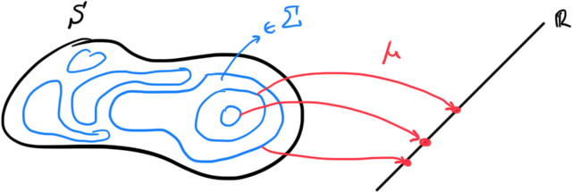
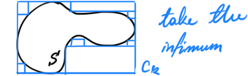

# Functional Analysis

Some notes on functional analysis for PDEs. The main aim of this is to construc a framework to prove things about dissipative systems and their symmetries but in the language of functional analysis and measure theory. 

## Measures

Let’s start by studying measures. In order to do this, we need something to measure. So we start with a set $S$. Ideally we would like to measure subsets of $S$. But there is no reason that we could (a priori) measure all of it’s subsets. So let’s first talk about some properties that the measurable subsets should have.

**<u>Definition:</u>** Given a set $S$ a <u>$\sigma$-algebra of $S$</u> is a subset $\Sigma$ of the powerset $\mathcal{P}(S)$ such that

1. $S \in \Sigma$
2. $\Sigma$ is closed under complementation (i.e. $A\in \Sigma \implies A^c\in \Sigma$)
3. $\Sigma$ is closed under countable unions (i.e. $\{A_k\} \subset \Sigma \implies \bigcup_k A_k \in \Sigma$)

***Corollary:*** This implues that $\empty \in \Sigma$ and that $\Sigma$ is closed under countable intersections too! Therefore, the smallest $\sigma$-algebra one can add on any set $S$ is $\Sigma = \{\empty, S\}$.

**<u>Definition:</u>** Given $\Sigma$, a $\sigma$-algebra of $S$ the pair $(S,\Sigma)$ is called a <u>measurable space</u>

Now to map the a actual subsets to some field like the real numbers. What we construct is a measure which works like the picture below.

**<u>Definition:</u>** Given a measurable space $(S,\Sigma)$ and an **ordered,** **compact** field $\mathbb{F}$ (like $\bar{\mathbb{R}} \coloneqq \mathbb{R} \cup\{-\infty,\infty\}$) a map $\mu:\Sigma \to \mathbb{F}$ is <u>measure</u> of $S$ iff

1. $\mu(\empty) = 0$
2. $\mu(A) \geq 0 \ \forall A\in \Sigma$
3. Given a sequence $\{A_k\} \subset \Sigma$ we have $\mu(\bigcup_kA_k) = \sum_k \mu(A_k)$

Also the pair $(S,\Sigma,\mu)$ is called a <u>measure space</u>.

*Notice* that measures are designed to steal the intuition from volumes of a set. Especially the last property about the additivity of the union is like taking a volume, chopping it up in little parts where the sum of their volume is the original volume. 

*Notice* that for now on we will be using $\mathbb{F} = \bar{\mathbb{R}}$.

### The Lebesgue measure

The Lebesgue measure is a way to define volumes in $\mathbb{R}^n$ in the intuitive way we are used to.  The idea is that if we can measure segments we can measure everything, by approximating it using segments.

**<u>Definition:</u>** Let $I = (a,b) \subset \mathbb{R}$ be a <u>segment</u>. Then we define its <u>length</u> $l(I)$ by
$$
\begin{equation*}
l(I) = b-a
\end{equation*}
$$
Then we can define an open interval $C \subset\mathbb{R}^n$ of $\mathbb{R}^n$ as the product of $n$ intervals $C = I_1\times I_2 \times \cdots \times I_n$. We define the <u>length</u> of $C$ like so:
$$
\begin{equation*}
l(C) = l(I_1) \times l(I_2) \times \cdots \times l(I_n)
\end{equation*}
$$
With this we can now measure the volumes of intervals in $\mathbb{R}^n$. Now we want to measure arbitrary subsets of $\mathbb{R}^n$. To do this we construct the Lebesgue outer measure.

**<u>Definition:</u>** Given a subset $E \subset \mathbb{R}^n$ The <u>Lebesgue outer measure</u> $\lambda^*$ is a map $\lambda^*: \mathcal{P}(E) \to \mathbb{\bar{R}}$ such that for some $A\subset E$ we have
$$
\begin{equation*}
\lambda^*(A) = \inf \Bigm\{\sum_k l(C_k) \Bigm|  \{C_k\} \subset \mathcal{P}(E) \text{ are intervals and } A \subset \bigcup_k C_k  \Bigm\}
\end{equation*}
$$
This forms a measure, and an interesting measurable space over $Ε$. The $\sigma$-algebra is given by the subsets $A \subset E$ such that $\forall B \subset E$ 
$$
\begin{equation*}
\lambda^*(B) = \lambda^*(B\cap A) + \lambda^*(B\cap A^c)
\end{equation*}
$$
***Corollary:*** These sets form a $\sigma$-algebra $\Sigma_E$ over $E$ so $(E,\Sigma_E)$ is a measurable space. We can add a measure $\lambda \coloneqq \lambda^*$ on $E$ so that $(E,\Sigma_E,\lambda)$ is a measure space. We call $\lambda$ the **Lebesgue measure.** We finally call $E$ a <u>Lebesgue Measurable Subset</u> of $\mathbb{R}^n$.

## Function Spaces

Given two sets we can define a set of all the functions from one to the other. However, there is no reason for this set to have any further structure, since we can’t do any operations on the functions. It is the codomain that allows us to operate on the functions. If operations are defined there, we can steal them and give a more interesting structure to the set of all functions! We will explore this here.

**<u>Definition:</u>** Given two sets $X$ and $Y$ we can define the set of all functions $f:X\to Y$ denoted by $Y^X$. 

The reason is that this set generalizes powers of sets. Take a look at [this](https://e.math.cornell.edu/people/belk/topology/FunctionSpaces.pdf) to find out why, it’s cool!

Now I would like to give some structure on $Y$ so that we can do operations on functions! Let’s add the structure of a Banach Space. Notice there is no restriction on the set $X$ at this point. 

**<u>Definition:</u>** A normed vector space $B$ is a <u>Banach space</u> iff it is complete, i.e. all Cauchy sequences converge in $B$.

**<u>*Examples:*</u>** Common examples are $\mathbb{R}^n$ even for $n=1$.

Having the tool of Banach spaces it is time to give more structure to our set of functions.

***Corollary:*** if $Y$ is a Banach space we can assign a vector space structure to $Y^X$. We define addition and scalar multiplication of functions pointwize using the operations of $B$. Say that $B$ is over a field $\mathbb{F}$ we then have that $\forall a \in \mathbb{F}\text{ and } \forall f,g \in Y^X$ we have that for each point $x\in X$
$$
\begin{align*}
(a\cdot f) (x) &= a\cdot (f(x))\\
(f+g)(x) &= f(x) + g(x)
\end{align*}
$$
defining an addition and scalar multiplication on $Y^X$ converting it to a vector space over $\mathbb{F}$. 

*Note* that these functions spaces are not necesssarily finite dimensional. In fact most often they are not, and that is ok.

## Measuring Function Spaces

To measure function spaces we need a metric. It would be nice, however, to induce it from some predefined measure on the domain of the functions. Here we will introduce the notion of the Lebesgue integral that allows us to create a map from functions to numbers, and we will then use it to create a metric on function spaces. Here we will actually define the [Bohner Integral](https://en.wikipedia.org/wiki/Bochner_integral) which is an extension of the Lebesgue integral for Banach valued functions. But since the extension is trivial we will still call it the Lebesgue integral :)

### Integration

**<u>Definition:</u>** Let $(X,\Sigma,\mu)$ be a measure space and $B$ a Banach space. We will consider functions $f:X\to B$. Given some subset $E \in \Sigma$ we define the <u>characteristic function</u> $1_E : X \to \mathbb{R}$ like so
$$
\begin{equation*}
1_E(x) = \begin{cases}
1 & \text{ if } x\in E\\
0 & \text{ if } x\notin E\\
\end{cases}
\end{equation*}
$$
We can construct functions in $B^X$ like so
$$
\begin{equation*}
s = \sum_{k} a_k 1_{E_k}
\end{equation*}
$$
where $a_k \in B$, and $E_k \in \Sigma$ . This type of linear combination of characteristic functions function is called <u>simple</u>.

> **Quick Sidenote:** Reading a functional analysis textbook someone might come across the distasteful and almost sacrilegious term that something is true for <u>“almost every”</u> point $x$. Believe it or not this has a precise definition smh. here it is.
>
> Given a measure space $(X,\Sigma,\mu)$ a property that holds for almost every $x \in X$ is such that if it is not true for a subset $E \subset X$ then there exists a larger subset $F \in \Sigma$ in the $\sigma$-algebra such that $E\subset F$ and $\mu(F) = 0$. In other words it might not be true for some points, but all these points have measure $0$ so we don’t care about them. **Just a heads up**

Now that we have simple functions we can start integrating them

**<u>Definition:</u>** A simple function $s = \sum_k a_k 1_{E_k}$ is called <u>integrable</u> iff $\mu(E_k) < \infty$. For integrable simple functions, their integral is given by
$$
\begin{equation*}
\int_X s\ d\mu = \int_X \sum_k a_k 1_{E_K}\ d\mu \coloneqq \sum_k a_k\, \mu(E_k)
\end{equation*}
$$

To define the integral for non-simple functions we need to figure out a way to know which ones we can take the integral of. 

**<u>Definition:</u>** A function $f:X\to B$ is called <u>measurable</u> iff there exists a sequence of simple functions $\{s_i\} \in B^X$ such that
$$
\begin{align*}
\lim_{n\to \infty} s_n(x) = f(x) && \text{for allmost all }x\in X
\end{align*}
$$
*Notice* the similarity of this definition to continuity in a metric space.

*Notice* that this uses the for almost all terminology, so it doesn’t have to hold for subsets of measure zero. Which allows discontinuities

**<u>Definition:</u>** Given a measurable function $f : X \to B$ it is <u>integrable</u> if there exists a sequence of simple functions $\{s_n\}$ such that 
$$
\begin{equation*}
\lim_{n\to \infty}\int_X ||f - s_n|| d\mu = 0
\end{equation*}
$$
where the integral is the ordinary Lebesgue integral of $\mathbb{R}$-valued functions.

**<u>Definition:</u>** Given an integrable function $f:X\to B$ we define its <u>integral</u> over $X$ under the measure $\mu$ to be
$$
\begin{equation*}
\int_X f\ d\mu = \lim_{n\to \infty} \int_X s_n\ d\mu
\end{equation*}
$$
***Corollary:*** The sequence $\left\{\int_X s_n\ d\mu\right\}$ is Cauchy. Hence since $B$ is complete, the integral exists for all integrable functions.

### Spaces of Integrable Functions

We have now defined an integral for Banach valued functions. As a result, we can go ahead and define spaces of integrable functions. Then we will add a Hilbert space structure on them in order to talk about operators and stuff!

**<u>Definition:</u>** An inner product space $H$  with inner product $\lang\cdot,\cdot\rang$ is a <u>Hilbert space</u> iff it is also a metric space with the metric defined by the inner product. 

***Corollary:*** A Hilbert space $H$ is also a normed space with a norm $||\cdot||$  given by 
$$
\begin{align*}
||x|| \coloneqq \lang x,x\rang && \forall x \in H
\end{align*}
$$
***Corollarollary:*** A Hilbert space is also a Banach space

Now that we have this out of the way, let’s put it in the back of our minds, and construct the sets of itnegrable functions

**<u>Definition:</u>** We say a function $f \in B^X$ is $p$-th lebesgue integrable or $f \in L^p(X,\Sigma,\mu;B)$ iff $||f||^p$ is Lebesgue integrable.

***Corollary:*** For $p>2$ the subspace $L^p(X,B,\mu)$ with inner product $\lang\cdot,\cdot\rang_L$
$$
\begin{equation*}
\lang f,g\rang_L \coloneqq \int_X \lang f,g\rang\, d\mu = \int_X f\cdot g\, d\mu
\end{equation*}
$$
Note that the product of $\lang f,g\rang$ is taken poinwise to create a function $\lang f,g\rang : X \to \mathbb{R}$ such that $\lang f,g\rang (x) = \lang f(x),g(x)\rang$, using the inner product of $B$.

**<u>Theorem:</u>** (Bochner Theorem) Given a measurable function $f:X\to B$ we have that
$$
\begin{equation*}
\norm{\int_X f\, d\mu} \leq \int_X \norm{f}\, d\mu
\end{equation*}
$$
and
$$
\begin{align*}
\left \langle v,\int_X f\,d\mu \right \rangle = \int_X \langle v,f\rangle\, d\mu && \forall v\in B
\end{align*}
$$

## Operators on Such Hilbert Spaces

Now we have a way of constructing Hilbert spaces using Banach valued functions and we can use these tools in order to study operators. We will represent differential equations as operators from one Hilbert Space to another. In this section we aim to study some properties of the operators to use in the upcming ones.

**<u>Definition:</u>** Let $X$ and $Y$ be two Banach spaces, then a linear map of vector spaces $A:X\to Y$ is called a <u>linear operator.</u> The <u>range of A</u> usually denoted as $R(A) \coloneqq \{y\in Y \mid y=Ax, \ x\in X\}$. The <u>null space of A</u> usually denoted as $N(A) \coloneqq \{x \in X \mid Ax = 0\}$.

Let’s classify them a bit more

**<u>Definition:</u>** A linear operator $A:X\to Y$ is

1.  <u>Bounded</u> iff $||A|| \coloneqq \sup\{||Ax||_Y \mid ||x||_X \leq 1 \} < \infty$

2. <u>Continuous</u> iff the preimage of every open set in $Y$ is open in $X$

3. <u>Closed</u> iff whenever $x_k \to x$ in $X$ and $Ax_k \to y$ in $Y$ then $Ax = y$

**<u>Theorem:</u>** A bounded linear operator is continious, and a closed linear operator is bounded.

**<u>Definition:</u>** Given a Hilbert space $H$ with inner product $\lang \cdot,\cdot\rang$ and a bounded, linear operator $A:H\to H$ we can define it’s <u>adjoint operator</u> $A^\dagger : H \to H$ by the property
$$
\begin{equation*}
\lang Ax,y\rang = \lang x,A^\dagger y\rang
\end{equation*}
$$
An operator where $A = A^\dagger$ is called <u>self adjoint</u> or <u>hermitian</u> depending on the norm it preserves.

