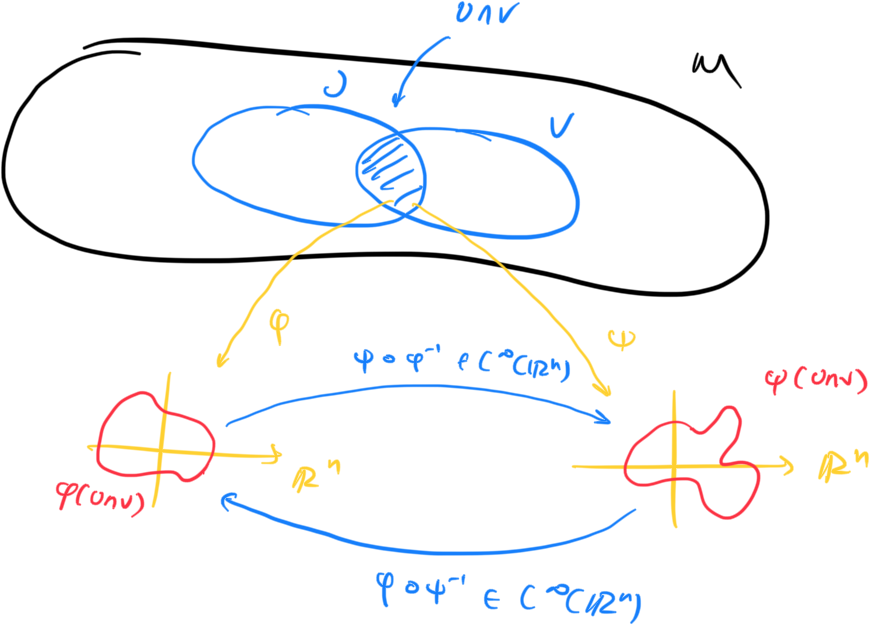
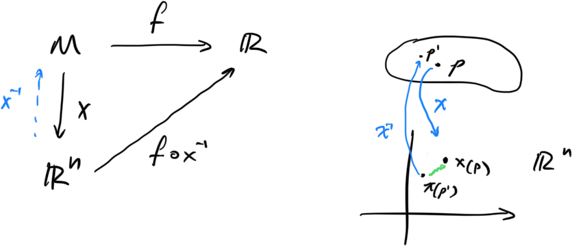
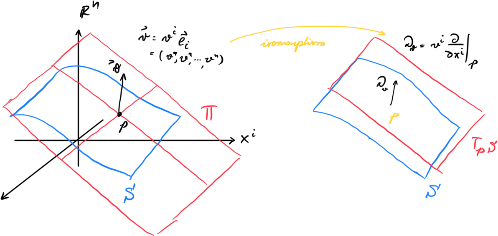
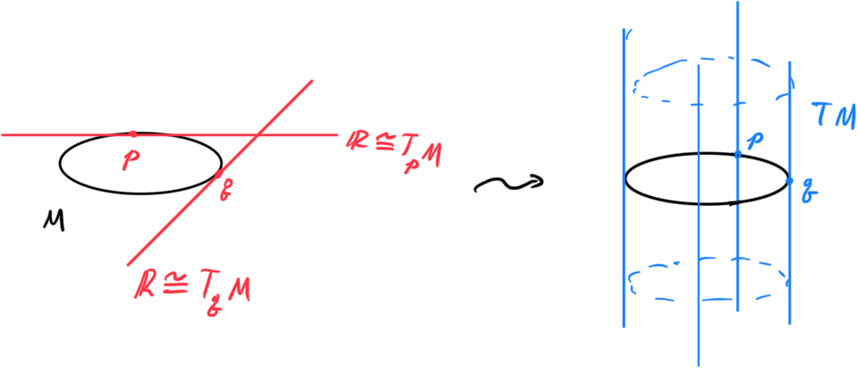
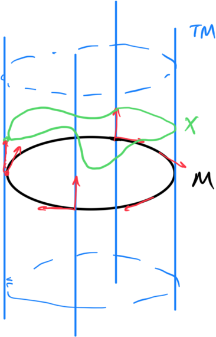

# Differential Geometry

Some definitions that one might find useful in the context of fully describing physical systems.

## Manifold Definitions

**<u>Definition:</u>** A Topological Space S is a set with a topology $\mathcal{T(S)}$ given by a collection of subsets of $S$ such that

1. $\empty,S \in \mathcal{T}(S)$
2. $\mathcal{T}(S)$ is closed under infinite unions and finite intersections

**<u>Definition:</u>** A Topological Manifold of dimension n is a Topological space $M$ such that

1. **Locally Eucledian**: $\forall U \in \mathcal{T}(M),\ \exists \phi:U\to\mathbb{R}^n$  such that $\phi$ is a homeomorphism
2. **Hausdorff**: Given two points $p,q \in M$, there exist two neighborhoods $U_p,\ U_q$ such that $U_p\cap U_q = \empty$

3. **Second Countability**: The topology of $M$ needs to be second countable

**<u>Definition:</u>** A chart $(U,\phi)$ on $M$ is a homeomorphism $\phi:U\to \mathbb{R}^n$ . An **atlas** $\mathcal{A}$ is a collection of maps. We say two maps $(U,\phi)$ and $(V,\psi)$ are compatible iff the maps 
$$
\psi \circ \phi^{-1}:\phi(U\cap V)\to\psi(U\cap V)\\
\phi \circ \psi^{-1}:\psi(U\cap V)\to\phi(U\cap V)
$$
are smooth in $\mathbb{R}^n$.

​                               

A compatible atlas, is an atlas where any two charts are compatible. A **maximal atlas** of a topological manifold $M$ is a compatible atlas that is also a cover of $M$.

**<u>Definition:</u>** A smooth Manifold $M$ of dimension n is a topological manifold of dimension n with a **maximal atlas**.

## Vectors

A coordinate system around a point $p \in M$ Where $M$ is a smooth manifold is a chart $(U_p,x)$ that includes $p$. In particular we can define a coordinate of a point $q \in U_p$ by using the standard coordinates of $\mathbb{R}^n$ $\{r^{i}\}$ like so:
$$
x^i \coloneqq r^i \circ x : U_p \to \mathbb{R}
$$
**<u>Definition:</u>** A function $f:M\to \mathbb{R}$  is smooth at a point $p \in M$ (sometimes denoted as $f\in C^\infty_p(M)$) iff for a chart $(U_p,x)$ that contains $p\in M$ the function
$$
f\circ x^{-1}:\mathbb{R}^n \to \mathbb{R}
$$
is smooth.

***<u>Corollary:</u>*** This is true for any chart you can pick around $p$

**<u>*Proposition:*</u>** The coordinate functions $\{x^i\}$ for any chart on $M$ are smooth.

**<u>Definition:</u>** Given $f\in C^\infty(M)$ its partial derivative at a point $p \in M$ with respect to a coordinate function $x^i$ is given by:
$$
\left.\frac{\part }{\part x^i}\right|_p f = \left.\frac{\part f}{\part x^i}\right|_p \coloneqq \left.\frac{\part f \circ x^{-1}}{\part r^i}\right|_{x(p)}
$$

**<u>*Note*</u>**: We define a differential operator
$$
\left.\frac{\part }{\part x^i}\right|_p : C^\infty_p(M)\to\mathbb{R}
$$
with the definition above. We note that this opeartor is linear. 

---

Detour to Derivations.

**<u>Definition:</u>** A **Derivation** $D_p$ at $p \in M$ is a linear map
$$
D_p:C^\infty_p(M)\to R
$$
With the following property called Leibnitz rule
$$
D_p(f\cdot g) = (D_pf)\cdot g + f\cdot (D_p g),\ \forall f,g \in C^{\infty}_p(M)**
$$
**<u>*Proposition:*</u>** Every Derivation at $p\in M$ is a derivative at $p$, and every derivative at $p$ is a derivation at $p$.

**<u>*Proposition*</u>**: The set of all derivations at a point $p\in M$, forms a vector space.

End of detour

---

A vector in diffential geometry takes an extra structure of a derivation. So let’s abstractly define a derivation, and then we will prove that all derivations are in fact partial derivatives of $C^\infty(M)$ functions on the manifold. 

**<u>Definition:</u>** The **Tangent Space**, denoted as $T_p (M) = T_pM$, at a point $p \in M$ is the vector space of all derivations at $p$.

***<u>Proposition:</u>*** Given a surface $S \subset \mathbb{R}^n$, the tangent plane $\Pi \subset \mathbb{R}^n$ at some $p \in S$, and the tangent space $T_pM$, we can show that $\forall v \in \Pi\ \exists!\ D_v \in T_pM$.

 

**Proof:** Consider the following map $\phi$
$$
\phi: \Pi \cong \mathbb{R}^{n-1}\to T_pS\\
\vec{v} = v^ie_i \to D_v \coloneqq v^i\left.\frac{\part}{\part x^i}\right|_p
$$
We will show that this map is an isomorphism of vector spaces. 

1. Invertible
2. Homomorphism (i.e. preserves vector addition and scalar multiplication)
3. (Show that a basis of $T_pS$ are the partial derivatives)

…

**<u>Notation:</u>** Given a vector $X_p \in T_pM$, given by $X_p = X^i_p \left.\frac{\part}{\part x^i}\right|_p$ at a point $p\in M$, and a function $f \in C^\infty(M)$ we often write
$$
X_pf\coloneqq X^i_p \left.\frac{\part }{\part x^i}\right|_p f = X^i_p \left.\frac{\part f}{\part x^i}\right|_p
$$

## Vector Fields

**<u>Definition:</u>** Given a smooth manifold $M$ we can define its tangent bundle $T(M) \coloneqq TM$ as the disjoint union of all the tangent spaces. Namely
$$
TM \coloneqq \coprod_{p\in M}T_pM
$$
Further, $(TM,\pi)$ is a fiber bundle over $M$ with the projection map $\pi$ given by
$$
\pi:TM\to M\\
TM \ni \bar{X}_p = X_p = (p,X_p \in T_pM) \mapsto p \in M
$$

**<u>Proposition:</u>** $\forall X_p \in T_pM\ \ \exists X_p \in TM$

Vector fields in DG are simply maps that assign vectors on points of the manifold.

**<u>Definition:</u>** A vector field $X$ on a manifold $M$ is a map
$$
X: M\to TM\\
p \in M \mapsto X(p) \coloneqq X_p \in T_pM \subset TM
$$
We want vector fields to be such that $\pi(X(p)) = p$, i.e. $\pi \circ X = id_M\ \forall X \in \mathfrak{X}(M)$

**<u>*Corollary:*</u>** A vector field is a section of the tangent Bundle $TM$ (i.e. a path that covers all of the points $p \in M$)

The space of all vector fields over a manifold $M$ is denoted as $\mathfrak{X}(M)$.

