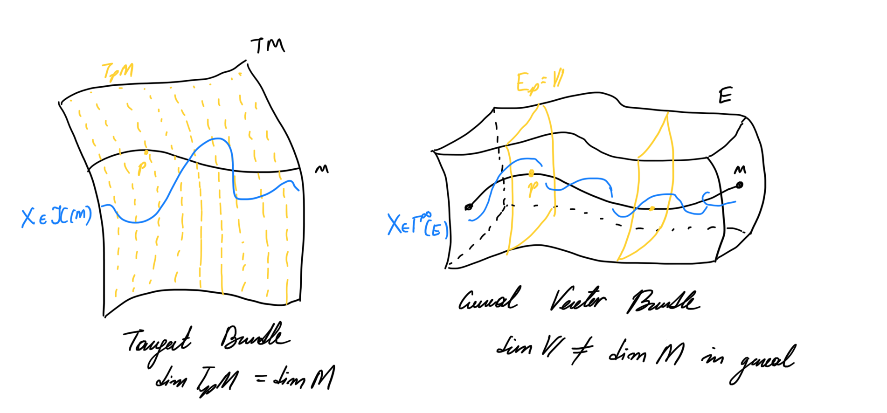
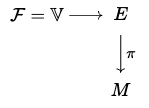

# Vector Valued Forms

Some notes so that I don’t forget the derivation of vector valued forms. They are used in the dissipation current formalism.

## Motivation

Given a smooth manifold $M$ we might want to add stuff to it other than vector fields on $M$, forms, or $C^\infty$ functions. I mean, I wanna add vectors that have a different number of components than the “natural” vectors one defines using  derivations on $M$. We can obviously do such a thing, therefore, why not try to define our forms and such structure but on a vector bundle over $M$! This way we can add whatever we want on top in a smooth way! Lemme draw some pictures to show what I mean. 

As a result one can use forms on vector bundles to deal with much more general smooth structures on manifolds.

------

## Vector Bundles

Let’s start this by defining a vector bindle.

**<u>Definition:</u>** A vector bundle $(E,\pi,M,\mathbb{V})$ of rank $m = \dim \mathbb{V}$ is the following fiber bundle over a smooth $n$-dimensional manifold $M$ 

where $\mathbb{V}$ is some vector space.

In principle we can define any structure over $E$ that we are alread familiar with. Let’s start simply with some sections.

**<u>Definition:</u>** We denote the set of smooth sections of $E$ over $M$ as $\Gamma^\infty(E)$.

Yeah duh! The other thing we can do to add elements of the geometry over Tangent Bundles in this case is to define canonical notions of the following vector bundle combinations of the vector bundles $E$ and $E'$
$$
\begin{align*}
E \otimes E' && E\wedge E' && E^* && E\oplus E'
\end{align*}
$$
 These have a conanonical structure of a vector bundle that I am trusting to not figure out myself.

The actual interesting thing is to incorporate the fact that the fiber of $E$ is a vector space! To do that we will introduce a metric.

**<u>Definition:</u>** A <u>bundle metric</u> $\lang\cdot,\cdot\rang$ is a smooth symmetric section of the vector bundle $E^*\otimes E^*$. In other words we see that $\forall p \in M$ we have that
$$
\begin{align*}
\lang\cdot,\cdot\rang_p:E_p\times E_p \to \mathbb{R}
\end{align*}
$$
where the map is symmetric, linear, and nondegenerate. Notice that we don’t impose positive difiniteness. 

----

## Vector Valued Forms

Here we will copy paste the form structure from the manifold on the vector bundle with the stupidest way.

**<u>Definition:</u>** A <u>vector valued $k$-form</u> is a smooth section of the following vector bundle $\left(\bigwedge^kT^*M\right) \otimes E$. Essentially, each $k$-form $\omega$ is given by
$$
\begin{align*}
\omega:\mathfrak{X}(M)\times \mathfrak{X}(M)&\to \Gamma^\infty(E)\\
(X,Y)&\mapsto\omega(X,Y) = \omega^i(X,Y) \sigma_i
\end{align*}
$$
where $\sigma_i \in C^\infty(E)$ and $\omega^i\in \Omega^k(M)$. We also define the set of all smooth vector valued $k$-forms as $\Omega^k(M,E) = \Gamma^\infty\left(\bigwedge^kT^*M \otimes E\right)$. We allso call $\Omega^0(M,E) = \Gamma^\infty(E)$

This is a cool thing, but now we wanna examine some of the properties of constructing $k-$forms. Hence, let’s introduce a wedge product to the mix! 

