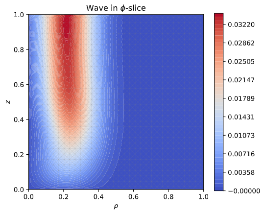
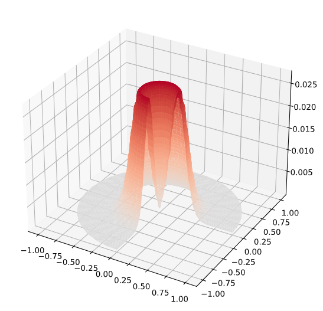

# FEM Study of Wave equation

Here we numerically solve the strongly damped wave equation using the Finite Element method. The code is written in python using scipy and numpy for efficient solving algorithms. Here one can also find output animations and images of nondimensionalized results concerning that wave equation.

## Contents
1. [**Theory**](https://github.com/PanosEconomou/LXe-Phonon/blob/master/Simulation/1.Solving_Engine/Theory_FEM.ipynb)\
All the theory behind our Finite Element Method implementation, including certain attempts to increase efficiency are included in this jupyter notebook file. A **.pdf** version of this notebook is available [**here**](https://github.com/PanosEconomou/LXe-Phonon/blob/master/Simulation/1.Solving_Engine/Theory_FEM.pdf)

2. [**FEM Library**](https://github.com/PanosEconomou/LXe-Phonon/blob/master/Simulation/1.Solving_Engine/fem.py)\
Based on the theory described in the lik above we developed a python module that implements the Finite Element Method for solving the wave equation, applying proper boundary conditions, etc.

3. [**Application**](https://github.com/PanosEconomou/LXe-Phonon/blob/master/Simulation/1.Solving_Engine/Application_FEM.ipynb)\
A test of an application of the theory implemented using the FEM library can be found in this jupyer notebook. A **.pdf** version of this notebook is available [**here**](https://github.com/PanosEconomou/LXe-Phonon/blob/master/Simulation/1.Solving_Engine/Application_FEM.pdf)

4. [**Animation Script 2D**](https://github.com/PanosEconomou/LXe-Phonon/blob/master/Simulation/1.Solving_Engine/fem_animation_script.py) and [**3D**](https://github.com/PanosEconomou/LXe-Phonon/blob/master/Simulation/1.Solving_Engine/3D_fem_animation_script.py)\
These scripts are designed to export an animation of the moving wave packet under a source designed to be a particle.

## Installation Instructions

### Running the code
If you want to run the code there you will need **python 3.8** and above. The following modules also need to be installed/updated for python 3.8.

    $ pip3 install numpy
    $ pip3 install matplotlib
    $ pip3 install tqdm
    $ pip3 install scipy

You will also need to install [**ffmpeg**](https://holypython.com/how-to-save-matplotlib-animations-the-ultimate-guide/) in order to export the animations to *.mp4* using the animation scipts. In mac this could be as simple as:

    $ brew install ffmpeg

In linux one can do
    
    $ sudo apt update
    $ sudo apt install ffmpeg

There might be some troubleshooting in this step. Matplotlib is not nice with its integration with ffmpeg...

### Performing a Simulation

To perform a simulation one needs to keep in mind that [**fem.py**](https://github.com/PanosEconomou/LXe-Phonon/blob/master/Simulation/1.Solving_Engine/fem.py) is a low level modue. Hence once can't just do "python3 fem.py" and have a result running. A good example of an application is found in [**this jupyter notebook**](https://github.com/PanosEconomou/LXe-Phonon/blob/master/Simulation/1.Solving_Engine/Application_FEM.ipynb).

## Results

The solver is designed to provide nondimensionalized results for the strongly damped wave equation with an arbitrary source term. An Example output of hte simulation is shown below

This figure illustrates the distribution of nondimensionalized pressure in cyllindrical coordinates dues to a moving particle along the z-axis. This is equivalent to taking a slice in a constant phi value and plotting the pressure at each of its points as a function of radius and height.

With some simple processing, as illustrated [**here**](https://github.com/PanosEconomou/LXe-Phonon/blob/master/Simulation/1.Solving_Engine/Application_FEM.ipynb) we can obtain z-slice for a particular pressure to get a more intuitive picture of how the shockwave looks like. This is shown for *z = 0.5* in the figure below.

More elaborate measurements are coming... : )